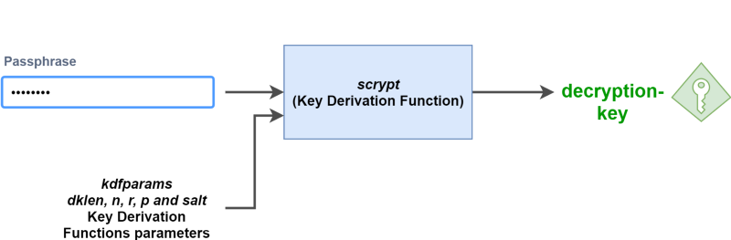

# Overview

钱包的密钥必须在本地加密存储，绝不能以明文的形式存储到服务器上，否则用户没有对自己钱包的绝对控制权。

# Key derivation

对用户敏感信息的加密存储需要使用到密钥，密钥从哪里来呢？ 这时，我们需要使用到KDF（key derive function), 常见的KDF有pbkdf2, scrypt 等算法。 KDF的工作原理如下图所示：

Passphrase为用户输入的密码, 通过scrypt算法继承出用于AES加密和解密的密钥。我们的设计中所有需要用到AES加密密钥的地方都应该使用这种方法生成。Keystore文件中对账户密钥进行加密的AES密钥，也是用户输入的密码继承而来。

# Storage

由于我们设计的是基于web的钱包，因此本地存储采用localStorage或者indexedDB的方式。经过调查发现，MyEtherWallet的持久化存储采用浏览器的localStorage：

> etherwallet\app\scripts\cxFuncs.js

```javascript
cxFuncs.storage = chrome.storage.sync;

cxFuncs.addWalletToStorage = function(address, encStr, nickname, callback) {
	nickname = nickname.replace(/(<([^>]+)>)/ig, "");
	var value = {
		nick: nickname,
		priv: encStr, //私钥经过加密过后的字符串
		type: 'wallet'
	};
	var keyname = ethUtil.toChecksumAddress(address);
	var obj = {};
	obj[keyname] = JSON.stringify(value);
	this.storage.set(obj, callback);
};

cxFuncs.getStorageArr = function(filter, callback) {
	var wallets = [];
	this.storage.get(null, function(items) {
		for (var key in items) {
			if (key !== 'localTokens' && items.hasOwnProperty(key)) {
				var tobj = JSON.parse(items[key]);
				if (tobj.type == filter) {
					tobj['addr'] = key;
					wallets.push(tobj);
				}
			}
		}
		wallets.sort(function(a, b) {
			if (a.nick < b.nick) return -1;
			if (a.nick > b.nick) return 1;
			return 0;
		});
		callback(wallets);
	});
};
```

# Question

- imToken钱包的每份助记词只能使用一个地址


#### 参考链接

- [What is an Ethereum keystore file?](https://medium.com/@julien.m./what-is-an-ethereum-keystore-file-86c8c5917b97)
